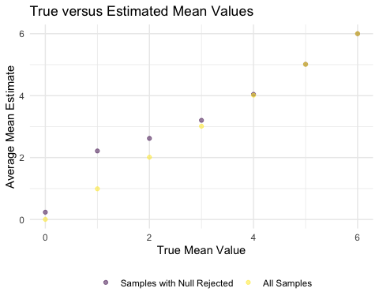
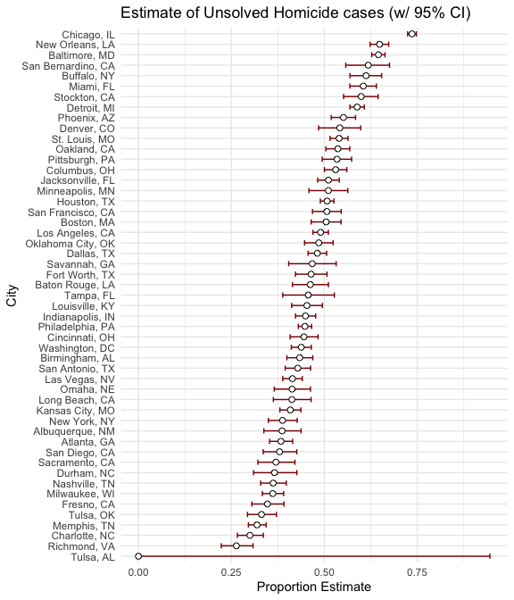

Iteration
================
Chhiring Lama
2024-11-13

## Problem 1

Creating function to see if atleast 2 people share the same birthday:

``` r
sim_bday <- function(sample_size) {
  
  bdays = sample(1:365, size =sample_size, replace = TRUE)
  
  duplicate <- length(unique(bdays)) < sample_size
  
  return(duplicate)
}
```

Iterations with different sample size

``` r
sim_results <- expand.grid(
  n = 2:50,
  iter = 1:10000
) |> 
  mutate(estimated_res = map_lgl(n, sim_bday)) |> 
  group_by(n) |> 
  summarize(prop = mean(estimated_res))
```

Plotting the probability:

``` r
sim_results |> 
  ggplot(aes(x = n, y = prop)) +
  geom_point() +
  labs(x = "Group Size", y = "Probability",
       title = "Probability of at least Two People with Same Birthday")
```


As shown in the figure, the probability of at least two people sharing
birthday increases when there are more people in the room. We need at
least 23 people in the room to have 50-50 possibility of at least two
people having the same birthday.

## Problem 2

In the one-sample t-test here, we have: $n = 30$, $\sigma = 5$ and
$\mu = 0$ where $X \sim Normal[\mu, \sigma]$.  
$H_o: \mu = 0$  
$H_o: \mu \neq 0$  

Function to obtain mean estimate $\hat{\mu}$ and p-value from the t-test
with $\alpha$ of 0.05.

``` r
test_model <- function(mean_val){
  sample = tibble(
    rnorm(30, mean = mean_val, sd = 5)
  )
  
  t_res <- t.test(sample, mu = 0, alternative = "two.sided")
  t_res_clean <- broom::tidy(t_res) |> 
    janitor::clean_names() |> 
    select(estimate, p_value)

  return(t_res_clean)
}

ttest_sim_results <- expand_grid(
    mu_val = 0,
    iter = 1:5000
  ) |> 
  mutate(sample_res = map(mu_val, test_model)) |> 
  unnest(sample_res)
```

Trying the test for other true means where $\mu = \{1, 2, 3, 4, 5, 6\}$:

``` r
ttest_sim_results_different_mu <- expand_grid(
    mu_val = 1:6,
    iter = 1:5000
  ) |> 
  mutate(sample_res = map(mu_val, test_model)) |> 
  unnest(sample_res)
```

Joining the results from using
$\mu = 0\ and\  \mu = \{1, 2, 3, 4, 5,6\}$

``` r
combined_t_results <- bind_rows(ttest_sim_results, 
                                ttest_sim_results_different_mu) |> 
  mutate(reject_Ho = p_value < 0.05) 
```

Plot power versus true value of $\mu$

``` r
combined_t_results |> 
  group_by(mu_val) |> 
  summarize(power = mean(reject_Ho)) |> 
  ggplot(aes(x = mu_val, y = power)) +
  geom_point()+
  labs(x = "True Mean value", y = "Power of the test",
       title = "Association Between Effect Size and Power")
```


With the increase in true effect size (true value of $\mu$), the power
of the test (to reject false null hypothesis) increases.

``` r
combined_t_results|> 
  group_by(mu_val) |> 
  mutate(overall_average = mean(estimate)) |> 
  ungroup() |> 
  group_by(mu_val, reject_Ho) |> 
  summarise(average_for_sampled_w_Ho_rejection = mean(estimate), 
            mean_overall_estimate = overall_average[1]) |> 
  ungroup() |> 
  filter(reject_Ho == TRUE) |> 
  pivot_longer(
    col = 3:4, 
    names_to = "mean_type", 
    values_to = "mean"
  ) |> 
  ggplot(aes(x = mu_val, y = mean, group = mean_type, color = mean_type)) +
  geom_point(alpha = 0.5) +
  labs(x = "True Mean Value", y = "Average Mean Estimate",
       title = "True versus Estimated Mean Values", color = "")
```



The sample average of $\hat{\mu}$ across tests for which the null is
rejected is approximately equal to the true value of $\mu$. It is
because estimated sample mean ($\hat{\mu}$)has to be different from the
null value (0) and closer to the actual $\mu$ to reject the null
hypothesis. This is the case for when we the true value is 1-6, however,
not for when true $\mu$ = 0, since reject the null means that the
estimate is different thatn 0.

## Problem 3

Load homicide data from the Washington Post:

``` r
homicide_data <- read_csv("data/homicide-data.csv") |> 
  mutate(state = toupper(state))
```

    ## Rows: 52179 Columns: 12
    ## ── Column specification ────────────────────────────────────────────────────────
    ## Delimiter: ","
    ## chr (9): uid, victim_last, victim_first, victim_race, victim_age, victim_sex...
    ## dbl (3): reported_date, lat, lon
    ## 
    ## ℹ Use `spec()` to retrieve the full column specification for this data.
    ## ℹ Specify the column types or set `show_col_types = FALSE` to quiet this message.

``` r
cities <- pull(homicide_data, city) |> unique() |> length()
states <- pull(homicide_data, state) |> unique() |> length()
```

The raw dataset has 52179 rows and 12 columns where each row is a
homicide case. Along with the case number, reported date, victim’s name,
their demographic information, it also has geographical information such
as city, state, longitude and latitude. There are cases from 50 cities
from `r`states`states. Similarly, the column`disposition\` remarks end
result of the case. I corrected state values to be uppercase, created a
city_state variable, and summarized the total number of homicides and
number of unsolved homicides in each city. Below is the list of 10
cities with most unsolved homicides.

``` r
homicide_data_clean <- homicide_data |> 
  mutate(city_state = str_c(city, state, sep = ", "), 
         result = case_when(disposition %in% c("Closed without arrest", 
                                                "Open/No arrest") ~ "unsolved", 
                            disposition == "Closed by arrest" ~ "solved")) |> 
  group_by(city_state, result) |> 
  summarize(homicide = n()) |> 
  pivot_wider(
    names_from = result, 
    values_from = homicide
  ) |> 
  mutate(unsolved = case_when(is.na(unsolved) == TRUE ~ 0, 
                              TRUE ~ unsolved), 
    total_homicide = sum(solved, unsolved, na.rm = TRUE)) |> 
  select(city_state, total_homicide, unsolved) |> 
  arrange(unsolved)
```

    ## `summarise()` has grouped output by 'city_state'. You can override using the
    ## `.groups` argument.

``` r
homicide_data_clean |> 
  head(10) |> 
  knitr::kable()
```

| city_state      | total_homicide | unsolved |
|:----------------|---------------:|---------:|
| Tulsa, AL       |              1 |        0 |
| Tampa, FL       |            208 |       95 |
| Durham, NC      |            276 |      101 |
| Richmond, VA    |            429 |      113 |
| Savannah, GA    |            246 |      115 |
| Sacramento, CA  |            376 |      139 |
| Albuquerque, NM |            378 |      146 |
| Long Beach, CA  |            378 |      156 |
| Denver, CO      |            312 |      169 |
| Fresno, CA      |            487 |      169 |

Running proportion test for Baltimore to estimate the proportion of
homicides that are unsolved:

``` r
baltimore_data <- homicide_data_clean |> 
  filter(city_state == "Baltimore, MD")

prop_result <- prop.test(baltimore_data$unsolved, 
                         baltimore_data$total_homicide, 
                         conf.level = 0.95, correct = TRUE) 
saveRDS(prop_result, "baltimore_unsolved_homicide_prop_test.rds")

prop_result <- prop_result |> 
  broom::tidy() |> 
  janitor::clean_names() |> 
  select(estimate, conf_low, conf_high) 

prop_result|> 
  knitr::kable()
```

|  estimate |  conf_low | conf_high |
|----------:|----------:|----------:|
| 0.6455607 | 0.6275625 | 0.6631599 |

The estimated proportion of unsolved homicides is 0.646. We are 95%
confident that true value of proportion of unsolved homicides is between
0.628 and 0.663.  

Function to run `prop.test` for each of the cities:

``` r
prop_function <- function(city_name) {
  subset <- homicide_data_clean |> 
  filter(city_state == city_name)
  
  prop_result <- prop.test(subset$unsolved, 
                         subset$total_homicide, 
                         conf.level = 0.95, correct = TRUE) |> 
    broom::tidy() |> 
    janitor::clean_names()
  return(prop_result)
}

prop_result_all_cities <- homicide_data_clean |> 
  mutate(prop_res = map(city_state, prop_function)) |> 
  unnest(prop_res) |> 
  select(estimate, conf_low, conf_high) |> 
  as_tibble()
```

Plot the results

``` r
prop_result_all_cities |> 
  mutate(city_state = fct_reorder(city_state, estimate)) |>
  ggplot(aes(x = city_state, y = estimate)) +
  geom_errorbar(aes(ymin = conf_low, ymax = conf_high),color = "darkred", width = 0.5)+
  geom_point(size = 2, shape = 21, fill = "white") +
  coord_flip()
```


